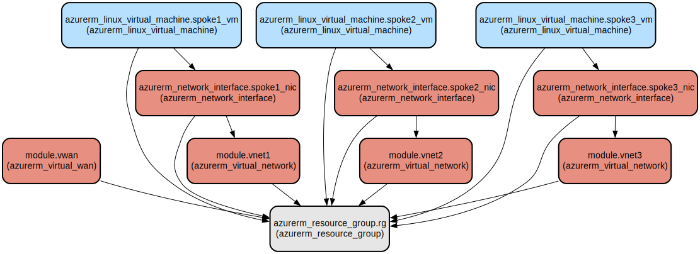

# Azure Virtual WAN Hub with Spoke Networks Infrastructure as Code

This Terraform project automates the deployment of an Azure Virtual WAN (VWAN) infrastructure with a hub and three spoke virtual networks. It creates a secure and scalable network topology with centralized connectivity management and includes virtual machines in each spoke network for testing and validation.

The infrastructure implements a hub-and-spoke network architecture using Azure Virtual WAN, which provides optimized and automated branch-to-branch connectivity. Each spoke network contains a Linux virtual machine, making it ideal for testing network connectivity and implementing network security policies. The solution supports enterprise-grade networking capabilities with simplified management and enhanced security through centralized control.

## Repository Structure
```
terraform/
├── main.tf                 # Primary configuration file defining VWAN, VNets, and VMs
├── provider.tf             # Azure provider configuration
├── variables.tf            # Input variable definitions
├── outputs.tf             # Output definitions for VWAN hub and VNet IDs
└── modules/               # Reusable module definitions
    ├── vnet/             # Virtual Network module
    │   ├── main.tf       # VNet and subnet resource definitions
    │   ├── variables.tf  # VNet module input variables
    │   └── outputs.tf    # VNet module outputs
    └── vwan/             # Virtual WAN module
        ├── main.tf       # VWAN and hub resource definitions
        ├── variables.tf  # VWAN module input variables
        └── outputs.tf    # VWAN module outputs
```

## Usage Instructions
### Prerequisites
- Azure subscription with appropriate permissions
- Terraform v1.0.0 or later
- Azure CLI installed and configured
- Subscription ID for Azure account

### Installation

1. Clone the repository and navigate to the terraform directory:
```bash
git clone <repository-url>
cd terraform
```

2. Initialize Terraform:
```bash
terraform init
```

3. Configure the Azure provider by adding your subscription ID to `provider.tf`:
```hcl
provider "azurerm" {
  subscription_id = "your-subscription-id"
  features {
    subscription {
      prevent_cancellation_on_destroy = true
    }
  }
}
```

### Quick Start

1. Review and modify the default variables in `variables.tf` if needed.

2. Create a Terraform plan:
```bash
terraform plan -out=tfplan
```

3. Apply the configuration:
```bash
terraform apply tfplan
```

### More Detailed Examples

Creating a custom spoke network configuration:
```hcl
module "custom_vnet" {
  source              = "./modules/vnet"
  name                = "custom-vnet"
  address_space       = ["10.4.0.0/16"]
  resource_group_name = azurerm_resource_group.rg.name
  location            = azurerm_resource_group.rg.location
  subnets = [
    {
      name           = "application"
      address_prefix = ["10.4.1.0/24"]
    },
    {
      name           = "database"
      address_prefix = ["10.4.2.0/24"]
    }
  ]
}
```

### Troubleshooting

Common Issues:

1. **Virtual Network Connection Failures**
   - Error: "Failed to create virtual network connection"
   - Solution: Verify that the address spaces don't overlap between VNets
   - Check Azure VWAN hub status in Azure Portal

2. **Permission Issues**
   - Error: "Authorization failed for resource group"
   - Solution: Ensure your account has Network Contributor role
   - Run `az account show` to verify current credentials

Debug Mode:
```bash
# Enable Terraform logging
export TF_LOG=DEBUG
export TF_LOG_PATH=terraform.log

# Run Terraform with debug output
terraform plan
```

## Data Flow

The Virtual WAN hub acts as a central transit point for all network traffic between spoke networks. Traffic flows through the hub, enabling centralized routing and security policy enforcement.

```ascii
                    +----------------+
                    |  Virtual WAN   |
                    |      Hub       |
                    | (10.100.0.0/16)|
                    +----------------+
                           |
            +-------------+-------------+
            |             |             |
    +---------------+  +---------------+  +---------------+
    |    Spoke 1    |  |    Spoke 2    |  |    Spoke 3    |
    | (10.1.0.0/16) |  | (10.2.0.0/16) |  | (10.3.0.0/16) |
    +---------------+  +---------------+  +---------------+
    |     VM 1      |  |     VM 2      |  |     VM 3      |
    +---------------+  +---------------+  +---------------+
```

Component Interactions:
1. Each spoke VNet connects to the Virtual WAN hub via secure connections
2. VMs in spoke networks communicate through the hub using private IP addresses
3. Hub provides automated routing between all connected spoke networks
4. Network security policies can be applied at the hub level
5. Each VM has a network interface in its respective spoke network
6. Address spaces are non-overlapping to ensure proper routing
7. Hub manages all transit traffic between spokes using internal routing

## Infrastructure



### Resource Group
- Type: `azurerm_resource_group`
- Name: transit-network-rg-rg
- Location: East US

### Virtual WAN
- Type: `azurerm_virtual_wan`
- Name: rg-virtual-wan
- SKU: Standard

### Virtual Hub
- Type: `azurerm_virtual_hub`
- Name: rg-virtual-hub
- Address Space: 10.100.0.0/16

### Virtual Networks
- Three spoke VNets with address spaces:
  - vnet1: 10.1.0.0/16
  - vnet2: 10.2.0.0/16
  - vnet3: 10.3.0.0/16

### Virtual Machines
- Three Ubuntu 18.04-LTS VMs (Standard_B1s)
  - One VM per spoke network
  - Each VM has a dynamic private IP